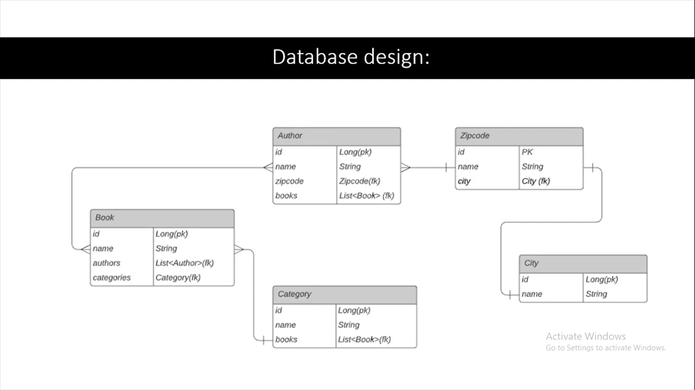

Spring Data JPA entity Relationship

- go to browser localhost:8181/swagger-ui/index.html#/

# Hibernate

- Cascade is the feature provided by hibernate to automatically manage the state of mapped entity whenever the state of its relationship owner entity is affected.
- The property cascade = CascadeType. ALL indicates that when we persist, remove, refresh or merge this entity all the entities held in this field would be persist, remove, delete or update.
- Lazy loading in Hibernate means fetching and loading the data, only when it is needed, from a persistent storage like a database. Lazy loading improves the performance of data fetching and significantly reduces the memory footprint.
